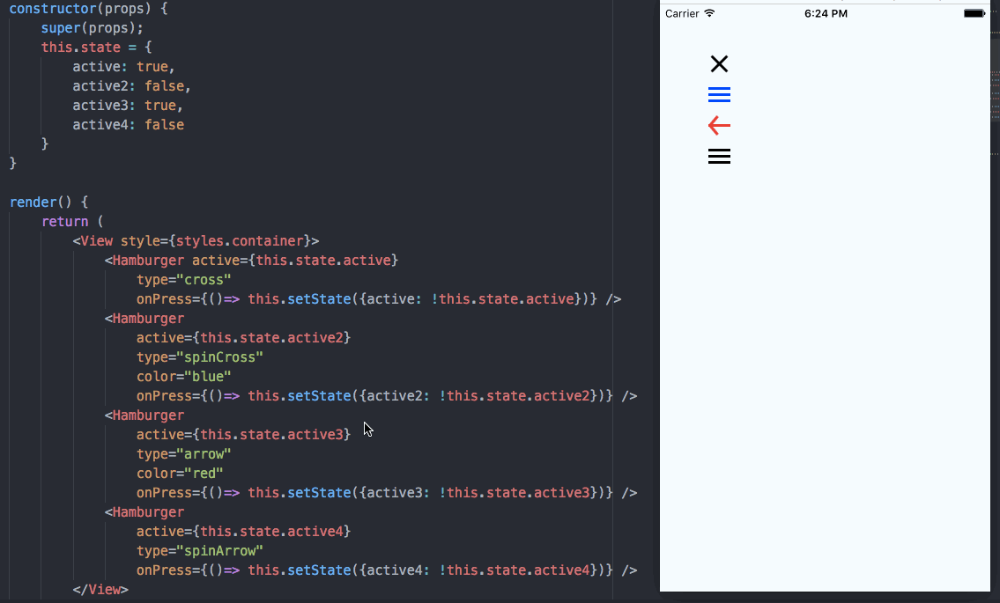

# RN-animated-hamburger
Animated fully configurable hamburger menu for react-native!

Upgrade of [this unmaintained repo](https://github.com/GeekyAnts/react-native-hamburger)

```
npm install @psyycker/rn-animated-hamburger --save
import Hamburger from '@psyycker/rn-animated-hamburger';
```



## API

| Property | Mandatory | Default | Type       | Description                                                                                  |
|----------|-----------|---------|------------|----------------------------------------------------------------------------------------------|
| active   | true      |         | boolean    | Boolean to set the component to active or not                                                |
| onPress  | true      |         | () => void | Callback called when the menu is clicked                                                     |
| type     | false     | cross   | string     | Defines the type of the menu icon. Options can be `cross` `spinCross` `arrow` `spinArrow`    |
| color    | false     | white   | string     | It'll change the color of the component. Any color which is usable in react native will work |
| borderRadius    | false     | false   | boolean     | Allow to set a border radius on the lines (6px) |

## Contribute

There is no much to do, but if you want to do something new, feel free to do a pull request!

## License
MIT
